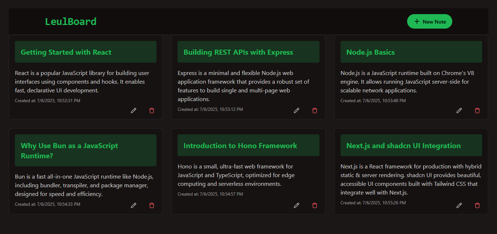
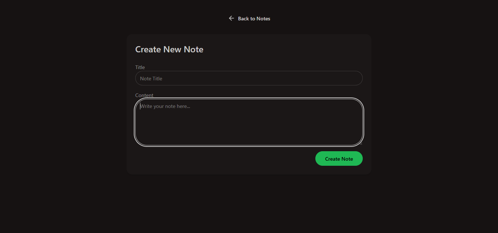
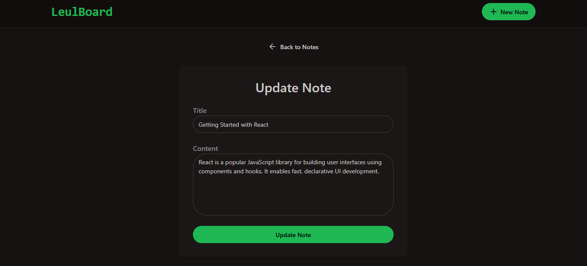
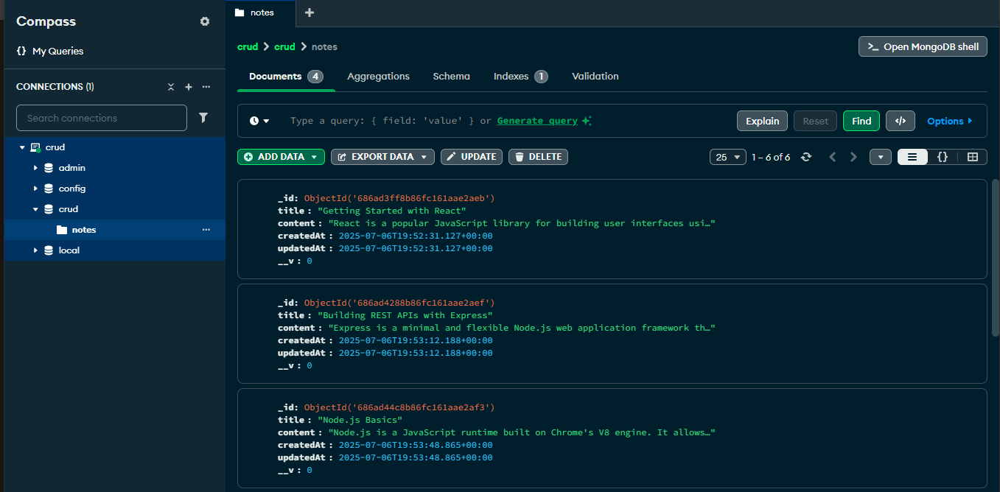
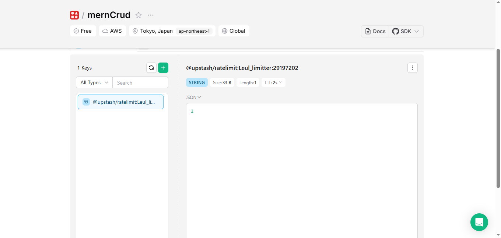

# MERN_CRUD Project

## 📸 Preview







## Overview

This project is a full-stack CRUD application for managing notes. It features a responsive, modern UI built with React, Tailwind CSS, and DaisyUI, and a robust Node.js/Express backend connected to MongoDB. API rate limiting with Upstash helps prevent abuse.

## ✨ Features

- **Full CRUD**: Create, read, update, and delete notes.
- **Responsive Design**: Optimized for mobile, tablet, and desktop.
- **Toast Notifications**: User-friendly feedback on all actions.
- **Rate Limiting**: Backend API protected with Upstash to limit requests.
- **Clean UI**: Built with Tailwind CSS + DaisyUI for a modern experience.

## 🛠️ Tech Stack

### Frontend

- **UI Library**: React 19
- **Styling**: Tailwind CSS
- **UI**: DaisyUI
- **Fetching**: Axios

### Backend

- **Database**: MongoDB
- **API**: Express
- **Routing**: Node.js
- **Rate Limiting**: Upstash

## 📁 Project Structure

```
/MERN_CRUD
├── backend/
│   ├── src/
│   │   ├── controllers/
│   │   ├── config/
│   │   ├── models/
│   │   ├── middleware/
│   │   ├── routes/
│   │   └── index.js
│   ├── .env
│   ├── package-lock.json
│   ├── package.json
│   └── ...
├── frontendd/
│   ├── src/
│   │   ├── components/
│   │   ├── pages/
│   │   │   ├── HomePage.jsx
│   │   │   ├── CreatePage.jsx
│   │   │   └── UpdatePage.jsx
│   │   └── App.jsx
|   |   ├── main.jsx
|   |   │
│   ├── package-lock.json
│   ├── tailwind.config.js
│   ├── postcss.config.js
│   ├── package.json
│   └── ...
├── HomePage.png
├── CreatePage.png
├── UpdatePage.png
└── README.md

```

## Project Details

### Technologies Used

- **Mongoose + MongoDB**: Database layer for data persistence.
- **Express**: Backend framework for building APIs.
- **React**: Frontend framework for building user interfaces.
- **DaisyUI**: A modern CSS library for styling React components.
- **Tailwind CSS**: A utility-first CSS framework for rapid UI development.
- **Upstash**: API rate limiting middleware for Express.

### Key Files and Directories

- **`backend/src/controllers`**: Handles CRUD logic.
- **`backend/src/config`**: Contains environment variables and database connection.
- **`backend/src/models`**: Defines database models.
- **`backend/src/routes`**: Defines routes for API endpoints.
- **`backend/src/index.js`**: Sets up the Express server.
- **`frontendd/src/pages`**: Contains React components for each page.
- **`frontendd/src/components`**: Contains reusable React components.
- **`frontendd/src/App.jsx`**: Defines the main application component.

## 🚀 Getting Started

### Prerequisites

- Node.js 18+ installed
- pnpm or npm package manager
- Git

### Installation Steps

1. Clone the repository:

   ```sh
   https://github.com/Leulc21/Mern_Crud.git
   ```

2. Navigate to the backend directory, install dependencies, and start the server:

   ```sh
   cd MERN_CRUD/backend
   npm install
   npm start

   ```

3. Open a new terminal, navigate to the frontend directory, install dependencies, and start the React app:

   ```sh
   cd frontendd
   npm install
   npm run dev

   ```

4. SOpen http://localhost:5173 (or your Vite/React port) in your browser to view the app

## 📝 License

This project is licensed under the MIT License - see the [LICENSE](LICENSE) file for details.

## 📞 Contact

For questions or feedback, reach out through:

- Email: leulchanie576@gmail.com
- Instagram: [@leulc21_type](https://www.instagram.com/leulch21?igsh=ejQ3OXRrMjE0NWxx)
- LinkedIn: [leulc1](https://www.linkedin.com/in/leul-chanie-7b10ba260?utm_source=share&utm_campaign=share_via&utm_content=profile&utm_medium=android_app)

---

Built with ❤️ by [Leul Chanie]
